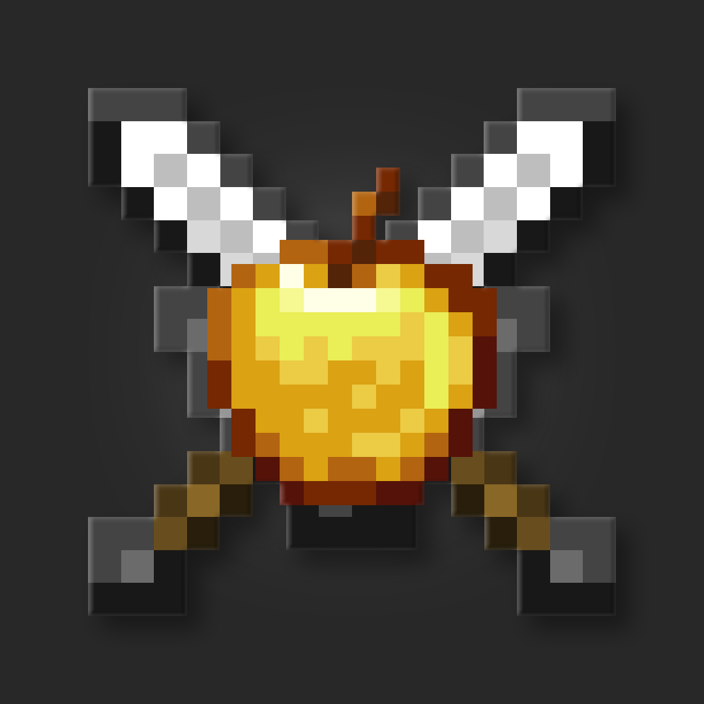

<br/>
<div align="center">
<a href="https://github.com/ShaanCoding/ReadME-Generator">

</a>
<h3 align="center">CasualChamionships</h3>
<p align="center">
The Minecraft mod used for CasualChampionship events!
</p>
</div>

## About The Project

CasualChampionships is a recurring event held by [Sensei](https://github.com/senseiwells) 
and [Santa](https://github.com/Super-Santa) for technical Minecraft servers.

Currently, CasualChampionships only consists of a single approximately 2 hour long 
UHC minigame, however, with plans to expand to adopt a more mcc-style format consisting 
of multiple shorter minigames.

### Built With

The majority of this mod relies upon the [arcade api](https://github.com/CasualChampionships/arcade)
which is a library designed for server-side fabric minigame development and is written in Kotlin.

## Getting Started

### Compiling

These are the steps for compiling CasualChampionships locally:

1. Clone the repo:
   ```sh
   git clone https://github.com/CasualChampionships/CasualChampionships.git
   ```
2. Build with Gradle:
   ```sh
   gradlew build
   ```
3. The mod will be built and located in your `build/libs` directory.

## Usage

### Installation

First, you will need a fabric server, follow 
[this guide](https://wiki.fabricmc.net/player:tutorials:install_server) 
if you do not have one already.

CasualChampionships also relies on the following mods, which you must have installed
separately:
- [Fabric API](https://modrinth.com/mod/fabric-api)
- [Fabric Language Kotlin](https://modrinth.com/mod/fabric-language-kotlin)
- [Placeholder API](https://modrinth.com/mod/placeholder-api)

### Configuration

Once you have all mods installed on your server, you can boot up your server
to generate the initial configuration files. 
These will be located in: `./config/casual-championships/`

In `config.json` is the configurations for syncing teams and stats with an
external database. 
This can be left blank (as default) and no syncing will happen.

The `packs` directory contains all additional and optional resource packs you
wish to use during the event, it also contains a subdirectory `generated` which
contains all the automatically generated resource packs used during the event,
you should not touch these.

The `event` directory contains the current event data for CasualChampionships.
You can modify `config.json`, by default, it will look like this:
```json
{
  "name": "default",
  "minigame": {
    "dimensions": {},
    "type": "casual:uhc_minigame"
  },
  "additional_packs": [],
  "operators": [],
  "lobby": "default"
}
```

This file declares the lobby for the event as well as the minigame which will be played:
- `"name"` is the name of the event (used to identify the event when syncing to the database)
- `"minigame"` the minigame definition, used to create a minigame for the event
- `"additional_packs"` file names of additional resource packs, located in aforementioned packs directory
- `"operators"` a list of admin usernames for the minigames
- `"lobby"` the lobby to use for the event, located in the lobbies directory

Let's first get our lobby configured, we'll need to create a lobby, an example one can
be found in [`docs/lobbies/example.zip`](./docs/lobbies/example.zip), you can customize
it by providing a custom world folder and defining your own values in the 
`casual_lobby_data.json` file.

The `casual_lobby_parkour_data.json` file is optional, if you do remove the file, remember
to remove the corresponding module in `minigame_data_modules.json`.

Once you've created your lobby place it in `./config/casual-championships/lobbies/`, you
can then reference it in the event configuration (exclude the `.zip`, if it's zipped).
```json5
{
  // ...
  "lobby": "example",
  // ...
}
```

By default, the minigame being played will be a UHC minigame. 
We can add additional configurations, such as specifying the dimensions
to use for the minigame, see the example below.
```json5
{
  // ...
  "minigame": {
    "type": "casual:uhc_minigame",
    "dimensions": {
      "minecraft:overworld": {
        "seed": 1234567890,
        "dimension": "casual:uhc_overworld"
      },
      "minecraft:the_nether": {
        "seed": 987654321,
        "dimension": "casual:uhc_nether"
      },
      "minecraft:the_end": {
        "dimension": "casual:uhc_end"
      }
    }
  },
  // ...
}
```

Once you have configured this you can run `/casual reload` or restart the server
to allow these changes to take effect.

### Joining

Only players with `op` will be able to join the server initially. 
Admins should be given `op` and join the server first to ensure everything is working
correctly, after which they can open the floodgates to allow other players to join with
the `/casual floodgates open` command.
If you have set up a connected database, players will need to be added into that database
 to join.

### Settings

Now that we're in the lobby, we can configure the settings of the minigame we want to play.
We can run `/lobby next settings` to modify the settings of the next minigame.
If you have the UHC minigame as your next minigame you will be able to change settings such
as "Border Completion Time", "Grace Period", "Instant Smelt Ores", and much more.

From here you can run `/lobby ready teams` to check that players are ready, you can 
run `/lobby countdown` to start the countdown to begin the next minigame, or just
`/lobby start` to jump straight into the next minigame.

### Notes

If you plan on playing UHC, it is worth pre-generating the chunks in the dimensions you
have specified in your UHC minigame definition, especially if you are playing with many
players. 
We recommend using [Chunky](https://modrinth.com/plugin/chunky) for this.

## License

Distributed under the MIT Licence. 
See [MIT Licence](https://opensource.org/licenses/MIT) for more information.
